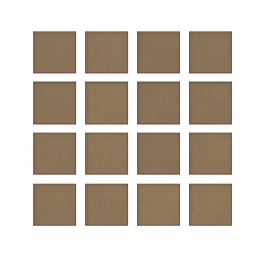

# 2020Internship
A collection of the work I have done in my 2020 Internship with Laurence Perreault-Levasseur at University of Montreal

## Goal
My final goal was to be able to produce realistic images of galaxies using state-of-the art generation networks, namely VAEs or GANs. The overall aim was to learn Machine Learning as I was somewhat new to the field. After studying by myself online on the basics, I undertook several steps in my project to convert my theoretical knowledge into practical applications.

### I - Building and training a basic CNN for image classification
This first part enabled me to be familiar with Tensorflow and more specifically the Keras API. This first problem is a very common starting ground for learning since it is fairly easy and accessible.

### II - Variational Auto-Encoder
Since my final goal is to generate images, I designed and trained a VAE on the GalaxyZoo dataset.

### III - Enhancement for VAEs
Because VAEs can produce pretty blurry images compared to GANs I tried to find ways to improve my previous "vanilla VAE" in the literature. I found a very interesting article that proposed an easy to understand and to implement method to alleviate such blurriness. This method is refferend to as a "Double-Stage VAE". (Links and references will be available in a dedicated section)
